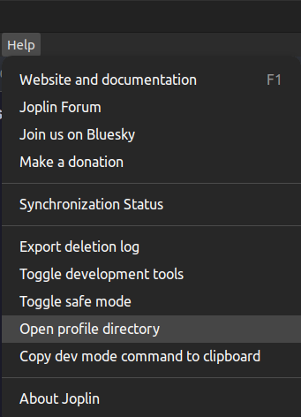
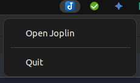

# Setup Artumis on Joplin

This is step 2 in [setting up your Artumis second brain](./install_guide_artumis_on_joplin.md). Now that Joplin is installed, I'm going to walk you through preparing the app to work as a full-powered second brain. To do this quickly, we will be copying settings and plugins directly into the Joplin profile directory. This is a powerful and fast way to tweak Joplin, but it may look a bit technical. These are the steps
1. [Open Joplin once to create the profile directory that will hold our settings](#create-and-open-the-profile-directory)
2. [Copy settings and plugins to the profile directory](#copy-settings-and-plugins-to-the-profile)
3. [Import the notes, notebooks and tags that make up the Artumis second brain system](#import-the-artumis-structure)
  
 

## Create and open the profile directory
To make sure Joplin creates its profile folder, start the app once. Then click `Help` -> `Open profile directory`. Keep the profile directory open in your file manager.  

Now close Joplin. Make sure Joplin is completely closed and not just minimized to the system tray. If you see a system tray icon of Joplin, right click it and select `Quit`. Alternatively close Joplin by pressing `Ctrl`+`q`.  

 

## Copy settings and plugins to the profile
[Download the latest Artumis release from this page](https://github.com/jeroenkroesen/artumis_on_joplin/releases). Extract it and copy the following files and folders to the profile directory, overwriting excisting files and folders:
* `userstyle.css`
* `userchrome.css`
* `settings.json`
* `keymap-desktop.json`
* `plugins` (folder)
  
 

## Import the Artumis structure
Open Joplin again and delete all default notebooks and notes and tags, so Joplin is completely empty.

Import the Artumis structure:
* Open the `File` menu
* Hoover over `Import`
* Click `JEX - Joplin Export File`
* Select the `.jex` file from the Artumis release.
	* It is called something like: `artumis_on_joplin_2025_03_30_001.jex`
 
Open the `(1).Start` note and go to the `Do` page to get started. The todo's there will walk you through Artumis.

Have fun!
